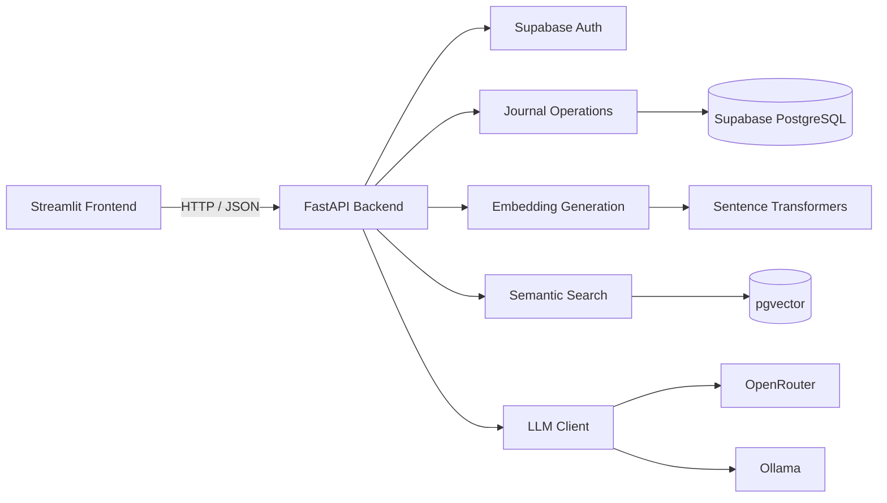

<div align="center">

# 🧠 Mnemo

### Your AI journal that remembers

**A private, personalized AI journal powered by semantic search and Retrieval-Augmented Generation.**

<br>


</div>

---

## 📖 Overview

**Mnemo** is a private AI-powered journal application that lets users store personal memories and ask natural-language questions about their past entries.

Instead of sending the entire journal to an LLM, Mnemo uses **semantic search** to retrieve the most relevant memories and then provides those memories as context to the LLM.

This creates a simple **Retrieval-Augmented Generation (RAG)** workflow.

### What Mnemo can do

- 🔐 Authenticate users securely
- 📝 Create journal entries
- 📚 View personal journal entries
- 🧬 Generate embeddings for journal entries
- 🔎 Search memories using semantic similarity
- 👤 Keep journal retrieval user-specific
- 🤖 Answer questions using retrieved memories
- 📌 Show the memories used to generate an answer
- 🔌 Support configurable LLM providers
- 🖥️ Provide a Streamlit web interface

---

## 🛠️ Tech Stack

| Area | Technology |
|---|---|
| Frontend | Streamlit |
| Backend | Python, FastAPI |
| Database | Supabase PostgreSQL |
| Vector Search | pgvector |
| Authentication | Supabase Auth |
| Embeddings | Sentence Transformers |
| Embedding Model | `all-MiniLM-L6-v2` |
| LLM | OpenRouter / Ollama |
| Configuration | python-dotenv |

---

## 🏗️ Architecture



---

## 🔄 How It Works

### 1. Authentication

The user logs in through the Streamlit frontend.

```text
User
 ↓
Streamlit Login
 ↓
FastAPI
 ↓
Supabase Auth
 ↓
JWT Access Token
```

The access token is used when making authenticated requests to the backend.

### 2. Creating a Journal Entry

When a user creates a journal entry:

```text
Journal Entry
      ↓
Streamlit
      ↓
FastAPI
      ↓
Generate Embedding
      ↓
Store Text + Embedding
      ↓
Supabase PostgreSQL / pgvector
```

Mnemo uses `all-MiniLM-L6-v2` to convert journal text into a **384-dimensional embedding vector**.

### 3. Semantic Search

When the user asks a question:

```text
User Question
      ↓
Generate Query Embedding
      ↓
pgvector Similarity Search
      ↓
Retrieve Relevant Memories
      ↓
Filter by Authenticated User
```

The system searches by **semantic meaning**, rather than requiring an exact keyword match.

---

## 🤖 Retrieval-Augmented Generation

The AI chat follows this pipeline:

```text
User Question
      ↓
Question Embedding
      ↓
Semantic Search
      ↓
Relevant Journal Entries
      ↓
Context Construction
      ↓
Question + Context
      ↓
LLM
      ↓
Generated Answer
      ↓
Answer + Retrieved Sources
      ↓
Streamlit
```

The LLM receives **retrieved memories as context** instead of relying only on its general knowledge.

---

## 🔌 LLM Provider Layer

Mnemo uses an LLM client abstraction so the rest of the application does not need to depend directly on a specific provider.

The provider is selected through environment variables.

### Supported providers

- **OpenRouter**
- **Ollama**

Example:

```env
LLM_PROVIDER=openrouter
LLM_BASE_URL=https://openrouter.ai/api/v1
LLM_API_KEY=
LLM_MODEL=openrouter/free
```

For local Ollama:

```env
LLM_PROVIDER=ollama
LLM_BASE_URL=http://localhost:11434/v1
LLM_API_KEY=ollama
LLM_MODEL=llama3.2
```

---

## 🔒 User Data Isolation

Each journal entry belongs to an authenticated user.

The application uses the authenticated user's identity when accessing journal data.

```text
User Login
    ↓
JWT
    ↓
Authenticated User ID
    ↓
Journal Queries
    ↓
Only That User's Memories
```

Semantic search also receives the user ID so retrieved memories remain user-specific.

---

## 📁 Project Structure

```text
personalized-ai-journal/
│
├── backend/
│   ├── app/
│   │   ├── __init__.py
│   │   ├── main.py
│   │   ├── auth.py
│   │   ├── dependencies.py
│   │   ├── embeddings.py
│   │   ├── journal.py
│   │   ├── chat.py
│   │   ├── llm_client.py
│   │   ├── supabase_client.py
│   │   └── config.py
│   │
│   └── requirements.txt
│
├── frontend/
│   └── app.py
│
├── .env.example
├── .gitignore
└── README.md
```

---

## ⚙️ Environment Configuration

Create a `.env` file for local development.

Use `.env.example` as the template.

### OpenRouter

```env
APP_ENV=development

SUPABASE_URL=
SUPABASE_KEY=

LLM_PROVIDER=openrouter
LLM_BASE_URL=https://openrouter.ai/api/v1
LLM_API_KEY=
LLM_MODEL=openrouter/free
```

### Ollama

```env
LLM_PROVIDER=ollama
LLM_BASE_URL=http://localhost:11434/v1
LLM_API_KEY=ollama
LLM_MODEL=llama3.2
```

---

## 🚀 Local Setup

### 1. Create a virtual environment

From the `backend` directory:

```bash
python -m venv venv
```

### 2. Activate the environment

**Windows PowerShell**

```powershell
venv\Scripts\Activate.ps1
```

**macOS / Linux**

```bash
source venv/bin/activate
```

### 3. Install dependencies

```bash
pip install -r requirements.txt
```

### 4. Configure environment variables

Create:

```text
backend/.env
```

Add your own Supabase and LLM configuration.

---

## ▶️ Run the Backend

From the `backend` directory:

```bash
uvicorn app.main:app --reload
```

FastAPI:

```text
http://127.0.0.1:8000
```

Interactive API documentation:

```text
http://127.0.0.1:8000/docs
```

---

## ▶️ Run the Frontend

Open another terminal and run:

```bash
cd frontend
streamlit run app.py
```

The Streamlit application will open in your browser.

---

## 🧭 Application Workflow

```text
Login
  ↓
Dashboard
  ↓
Create Journal Entry
  ↓
Generate Embedding
  ↓
Store Journal + Embedding
  ↓
Ask AI
  ↓
Generate Query Embedding
  ↓
Retrieve Relevant Memories
  ↓
Send Context to LLM
  ↓
Generate Answer
  ↓
Display Answer + Sources
```

---

## 💡 Example

A user writes:

> Today I had a technical interview. I was nervous at first, but after answering the first few questions I became more confident.

Later, the user asks:

> When was I nervous about an interview?

Mnemo:

1. Converts the question into an embedding.
2. Searches the user's journal embeddings.
3. Retrieves the relevant memory.
4. Provides the retrieved memory to the LLM.
5. Generates an answer.
6. Displays the answer and retrieved source.

---

## 🖥️ Main Application Sections

| Section | Purpose |
|---|---|
| 🏠 Dashboard | Overview of the user's journal and memories |
| ✍️ New Journal | Create a new journal entry |
| 📚 My Journals | View saved journal entries |
| 🤖 Ask AI | Ask questions about previous memories |

---

## 🔐 Security

Sensitive configuration is stored through environment variables rather than hard-coded into the application.

Do **not** commit:

```text
.env
API keys
Supabase credentials
JWT access tokens
Passwords
```

The `.gitignore` file is configured to keep local and sensitive files out of version control.

---

## 🎯 Project Purpose

Mnemo demonstrates how a traditional journal application can be enhanced with AI memory.

The project brings together:

- User authentication
- REST APIs
- PostgreSQL
- Vector embeddings
- Semantic search
- pgvector
- Retrieval-Augmented Generation
- LLM integration
- Streamlit

into one end-to-end application.

---

## 👤 Author

**Shubham Rajput**

AI / GenAI Portfolio Project

---

<div align="center">

### 🧠 Mnemo

**Write it. Remember it. Ask it.**

</div>
